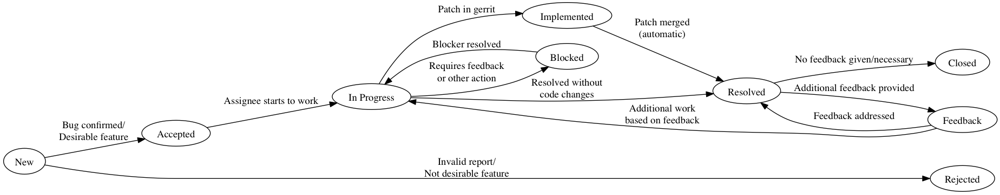

Guidelines for creating meaningful redmine issue reports
========================================================
This section gives some started on how to generate useful issues on the
|Gromacs| `redmine issue tracker`_. The information here comes to a large extent
directly from there, to help you in preparing your reports.

.. _redmine issue tracker: https://redmine.gromacs.org

What to report
^^^^^^^^^^^^^^
Please only report issues you have confirmed to be caused by |Gromacs| behaving in an
unintended way, and that you have investigated to the best of your ability. If you have
large simulations fail at some point, try to also trigger the problem with smaller test
cases that are more easily debuggable.

Bugs resulting from the use third-party software should be investigated first to make sure
that the fault is in |Gromacs| and not in other parts of the toolchain.

Please don't submit generic issues resulting from system instabilities and systems :ref:`blowing-up`.

What should be included
^^^^^^^^^^^^^^^^^^^^^^^
The report should include a general description of the problem with |Gromacs| indicating 
both the expected behaviour and the actual outcome. If the issue causes program
crashes, the report should indicate where the crash happens and if possible
include the stack trace right up to the crash. 

All bugs should include the necessary information for the developers to reproduce the errors, 
including if needed minimal input files (\*tpr, \*top, \*mdp, etc),
run commands or minimal version of run scripts, how you compiled |Gromacs| and if possible the system architecture.

The emphasis should be on having a *minimal* working example that is easy to follow for the developers, that 
does not result in any warnings or errors in itself. If your example generates errors, your issue will likely
not be considered as *real*, or at the minimum it will be much harder to analyse to find the actual issue.

If your inputs are sensitive, then it is possible to create private Redmine issues so that the
developer team can have access to solve the problem, while preventing widespread
visibility on the internet.

Supporting the developers
^^^^^^^^^^^^^^^^^^^^^^^^^
In general you should be able to answer questions posed to you by the developers
working on the program, if you want to help them in fixing the bug you found. This may
include things such as explaining run scripts or simulation set-up, as well as 
confirming issues with different versions of the program and different combinations
of supported libraries and compilers. 

Please refrain from setting things such as target version or deciding on unreasonable priorities. If you decide
to fix the issue on your own, please adhere to the other standards mentioned on the related pages
:ref:`code-formatting` and :ref:`code-commitstyle`.

General issue workflow
^^^^^^^^^^^^^^^^^^^^^^

The general issue workflow is shown in the figure below:

.. Text below is stolen from the old Gromacs web page

.. Before opening a new issue, take a minute and make it easy for everybody else (in particular the developers!) to help you - that way you are much more likely to get a solution to your problem.

.. 1. Isolate the problem as far as possible. If you submit a huge tpr file that sometimes fails after a million steps, it is pretty much guaranteed that nobody is going to debug it.

.. 2. Upload a single small example of how a simulation (or some other GROMACS program) crashes. This should ideally be a single (small) conf.gro file, topol.top, and grompp.mdp. Make sure that your input files are processed without warnings for the GROMACS version you are submitting a bug report for, and don't rely on some large external force field or long script. In most cases these additional files and warnings are of course completely unrelated to the problem, but particularly in that case you are helping others a lot by not having to take them into account.

.. 3. Provide a very concise report of exactly what commands you used (so it can be reproduced), what behavour you expected, and what you got.

.. 4. Please don't set a target version unless you are the person working on the bug.

.. 5. If you set the priority to "high" as a user, we assume this means you will also prioritize it yourself and provide close to instant feedback and/or help with testing. If you are a developer, setting the priority to "high" means you are working on fixing this bug yourself. In other words: Please do not set the priority to "high" just to get somebody else to fix it faster.

.. At some point it might be necessary to have more files (including those large scripts) to debug the problem, but you are much more likely to get help if developers do not have to search for files in several different places, read up on a number of threads on the mailing list, follow a long discussion about what you want to do, and then decipher scripts to understand what happened.
