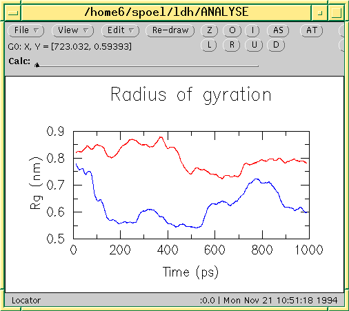

File formats
============

.. TODO in future patch: update for accuracy, organize better, improve formatting

Summary of file formats
^^^^^^^^^^^^^^^^^^^^^^^

Parameter files
---------------

:ref:`mdp`
    run parameters, input for :ref:`gmx grompp` and :ref:`gmx convert-tpr`

:ref:`m2p`
    input for :ref:`gmx xpm2ps`

Structure files
---------------

:ref:`gro`
    GROMACS format
:ref:`g96`
    GROMOS-96 format
:ref:`pdb`
    brookhaven Protein DataBank format
**Structure+mass(db):** :ref:`tpr`, :ref:`gro`, :ref:`g96`, or :ref:`pdb`
    Structure and mass input for analysis tools.
    When gro or pdb is used approximate masses will be read from the mass database.

Topology files
--------------

:ref:`top`
    system topology (ascii)
:ref:`itp`
    include topology (ascii)
:ref:`rtp`
    residue topology (ascii)
:ref:`ndx`
    index file

Run Input files
---------------

:ref:`tpr`
    system topology, parameters, coordinates and velocities (binary, portable)

Trajectory files
----------------

:ref:`tng`
    Any kind of data (compressed, portable, any precision)
:ref:`trr`
    x, v and f (binary, full precision, portable)
:ref:`xtc`
    x only (compressed, portable, any precision)
:ref:`gro`
    x and v (ascii, any precision)
:ref:`g96`
    x only (ascii, fixed high precision)
:ref:`pdb`
    x only (ascii, reduced precision)
**Formats for full-precision data:**
    :ref:`tng` or :ref:`trr`
**Generic trajectory formats:**
    :ref:`tng`, :ref:`xtc`, :ref:`trr`, :ref:`gro`, :ref:`g96`, or :ref:`pdb`

Energy files
------------

:ref:`ene`
    energies, temperature, pressure, box size, density and virials (binary)
:ref:`edr`
    energies, temperature, pressure, box size, density and virials (binary, portable)
**Generic energy formats:**
    :ref:`edr` or :ref:`ene`

Other files
-----------

:ref:`dat`
    generic, preferred for input
:ref:`edi`
    essential dynamics constraints input for :ref:`gmx mdrun`
:ref:`eps`
    Encapsulated Postscript
:ref:`log`
    log file
:ref:`map`
    colormap input for :ref:`gmx do_dssp`
:ref:`mtx`
    binary matrix data
:ref:`out`
    generic, preferred for output
:ref:`tex`
    LaTeX input
:ref:`xpm`
    ascii matrix data, use :ref:`gmx xpm2ps` to convert to :ref:`eps`
:ref:`xvg`
    xvgr input

File format details
^^^^^^^^^^^^^^^^^^^

.. _cpt:

cpt
---

The cpt file extension stands for portable checkpoint file.
The complete state of the simulation is stored in the checkpoint file,
including extended thermostat/barostat variables, random number states
and NMR time averaged data.
With domain decomposition also the some decomposition setup information
is stored.

See also :ref:`gmx mdrun`.

.. _dat:

dat
---

Files with the dat file extension contain generic input or output.
As it is not possible
to categorise all data file formats, GROMACS has a generic file format called
dat of which no format is given.

.. _dlg:

dlg
---

The dlg file format is used as input for the :ref:`gmx view`
trajectory viewer. These files are not meant to be altered by the end user.

Sample
++++++

::

    grid 39 18 {

    group "Bond Options" 1 1 16 9 {
      radiobuttons { " Thin Bonds"  " Fat Bonds" " Very Fat Bonds" " Spheres" }
            "bonds" "Ok" " F" "help bonds"
    }

    group "Other Options" 18 1 20 13 {
      checkbox " Show Hydrogens"      ""  "" "FALSE" "help opts"
      checkbox " Draw plus for atoms" ""  "" "TRUE"  "help opts"
      checkbox " Show Box"            ""  "" "TRUE"  "help opts"
      checkbox " Remove PBC"          ""  "" "FALSE" "help opts"
      checkbox " Depth Cueing"        ""  "" "TRUE"  "help opts"
      edittext "Skip frames: "        ""  "" "0"     "help opts"
    }

    simple 1 15 37 2 {
      defbutton "Ok" "Ok" "Ok" "Ok" "help bonds"
    }

    }

.. _edi:

edi
---

Files with the edi file extension contain information for :ref:`gmx mdrun`
to run Molecular Dynamics with Essential Dynamics constraints.

.. WEDSAM and ESSDYN seem to have vanished from WhatIf and the web
   These files can be generated by the program <tt>WEDSAM</tt> which uses
   output from the programs in the <tt>ESSDYN</tt> menu of the
   <A HREF="http://www.sander.embl-heidelberg.de/whatif/">WHAT IF</A> program.

.. _edr:

edr
---

The edr file extension stands for portable energy file.
The energies are stored using the xdr protocol.

See also :ref:`gmx energy`.

.. _ene:

ene
---

The ene file extension stands for binary energy file. It holds the
energies as generated during your :ref:`gmx mdrun`.

The file can be transformed to a portable energy file (portable
across hardware platforms), the :ref:`edr` file using the program
:ref:`gmx eneconv`.

See also :ref:`gmx energy`.

.. _eps:

eps
---

The eps file format is not a special GROMACS format, but just a
variant of the standard PostScript(tm). A sample eps file as
generated by the :ref:`gmx xpm2ps` program is
included below. It shows the secondary structure of a peptide as a function
of time.

.. image:: plotje.gif
   :alt:  hallo

.. _g96:

g96
---

A file with the g96 extension can be a GROMOS-96 initial/final
configuration file or a coordinate trajectory file or a combination of both.
The file is fixed format, all floats are written as 15.9 (files can get huge).
GROMACS supports the following data blocks in the given order:

 * Header block:

    - ``TITLE`` (mandatory)

 * Frame blocks:

    - ``TIMESTEP`` (optional)
    - ``POSITION/POSITIONRED`` (mandatory)
    - ``VELOCITY/VELOCITYRED`` (optional)
    - ``BOX`` (optional)

See the GROMOS-96 manual for a complete description of the blocks.

Note that all GROMACS programs can read compressed or g-zipped files.

.. _gro:

gro
---

Files with the gro file extension contain a molecular structure in
Gromos87 format. gro files can be used as trajectory by simply
concatenating files. An attempt will be made to read a time value from
the title string in each frame, which should be preceded by
'``t=``', as in the sample below.

A sample piece is included below::

    MD of 2 waters, t= 0.0
        6
        1WATER  OW1    1   0.126   1.624   1.679  0.1227 -0.0580  0.0434
        1WATER  HW2    2   0.190   1.661   1.747  0.8085  0.3191 -0.7791
        1WATER  HW3    3   0.177   1.568   1.613 -0.9045 -2.6469  1.3180
        2WATER  OW1    4   1.275   0.053   0.622  0.2519  0.3140 -0.1734
        2WATER  HW2    5   1.337   0.002   0.680 -1.0641 -1.1349  0.0257
        2WATER  HW3    6   1.326   0.120   0.568  1.9427 -0.8216 -0.0244
       1.82060   1.82060   1.82060

Lines contain the following information (top to bottom):

 * title string (free format string, optional time in ps after '``t=``')
 * number of atoms (free format integer)
 * one line for each atom (fixed format, see below)
 * box vectors (free format, space separated reals), values:
   v1(x) v2(y) v3(z) v1(y) v1(z) v2(x) v2(z) v3(x) v3(y),
   the last 6 values may be omitted (they will be set to zero).
   |Gromacs| only supports boxes with v1(y)=v1(z)=v2(z)=0.

This format is fixed, ie. all columns are in a fixed
position. Optionally (for now only yet with trjconv) you can write gro
files with any number of decimal places, the format will then be
``n+5`` positions with ``n`` decimal places (``n+1``
for velocities) in stead of ``8`` with ``3`` (with
``4`` for velocities). Upon reading, the precision will be
inferred from the distance between the decimal points (which will be
``n+5``). Columns contain the following information (from left to
right):

 * residue number (5 positions, integer)
 * residue name (5 characters)
 * atom name (5 characters)
 * atom number (5 positions, integer)
 * position (in nm, x y z in 3 columns, each 8 positions with 3 decimal places)
 * velocity (in nm/ps (or km/s), x y z in 3 columns, each 8 positions with 4 decimal places)

Note that separate molecules or ions (e.g. water or Cl-) are regarded
as residues.  If you want to write such a file in your own program
without using the GROMACS libraries you can use the following formats:

C format
    ``"%5d%-5s%5s%5d%8.3f%8.3f%8.3f%8.4f%8.4f%8.4f"``
Fortran format
    ``(i5,2a5,i5,3f8.3,3f8.4)``
Pascal format
    This is left as an exercise for the user

Note that this is the format for writing, as in the above example
fields may be written without spaces, and therefore can not be read
with the same format statement in C.

.. _hdb:

hdb
---

The hdb file extension stands for hydrogen database
Such a file is needed by :ref:`gmx pdb2gmx`
when building hydrogen atoms that were either originally missing, or that
were removed with ``-ignh``.

.. _itp:

itp
---

The itp file extension stands for include topology. These files are included in
topology files (with the :ref:`top` extension).

.. _log:

log
---

Logfiles are generated by some GROMACS programs and are usually in
human-readable format. Use ``more logfile``.

.. _m2p:

m2p
---

The m2p file format contains input options for the
:ref:`gmx xpm2ps` program. All of these options
are very easy to comprehend when you look at the PosScript(tm) output
from :ref:`gmx xpm2ps`.

::

    ; Command line options of xpm2ps override the parameters in this file
    black&white              = no           ; Obsolete
    titlefont                = Times-Roman  ; A PostScript Font
    titlefontsize            = 20           ; Font size (pt)
    legend                   = yes          ; Show the legend
    legendfont               = Times-Roman  ; A PostScript Font
    legendlabel              =              ; Used when there is none in the .xpm
    legend2label             =              ; Used when merging two xpm's
    legendfontsize           = 14           ; Font size (pt)
    xbox                     = 2.0          ; x-size of a matrix element
    ybox                     = 2.0          ; y-size of a matrix element
    matrixspacing            = 20.0         ; Space between 2 matrices
    xoffset                  = 0.0          ; Between matrix and bounding box
    yoffset                  = 0.0          ; Between matrix and bounding box
    x-major                  = 20           ; Major ticks on x axis every .. frames
    x-minor                  = 5            ; Id. Minor ticks
    x-firstmajor             = 0            ; First frame for major tick
    x-majorat0               = no           ; Major tick at first frame
    x-majorticklen           = 8.0          ; x-majorticklength
    x-minorticklen           = 4.0          ; x-minorticklength
    x-label                  =              ; Used when there is none in the .xpm
    x-fontsize               = 16           ; Font size (pt)
    x-font                   = Times-Roman  ; A PostScript Font 
    x-tickfontsize           = 10           ; Font size (pt)
    x-tickfont               = Helvetica    ; A PostScript Font
    y-major                  = 20
    y-minor                  = 5
    y-firstmajor             = 0
    y-majorat0               = no
    y-majorticklen           = 8.0
    y-minorticklen           = 4.0
    y-label                  = 
    y-fontsize               = 16
    y-font                   = Times-Roman
    y-tickfontsize           = 10
    y-tickfont               = Helvetica

.. _map:

map
---

This file maps matrix data to RGB values which is used by the
:ref:`gmx do_dssp` program.

The format of this file is as follow: first line number of elements
in the colormap. Then for each line: The first character is
a code for the secondary structure type.
Then comes a string for use in the legend of the plot and then the
R (red) G (green) and B (blue) values.

In this case the colors are
(in order of appearance): white, red, black, cyan, yellow, blue, magenta, orange.

::

    8
    ~  	Coil		1.0	  1.0	  1.0
    E 	B-Sheet		1.0	  0.0	  0.0
    B 	B-Bridge	0.0	  0.0	  0.0
    S 	Bend		0.0	  0.8	  0.8
    T 	Turn		1.0	  1.0	  0.0
    H 	A-Helix		0.0	  0.0	  1.0
    G 	3-Helix		1.0	  0.0	  1.0
    I 	5-Helix		1.0	  0.6	  0.0

.. _mdp:

mdp
---

See the user guide for a detailed description of the options.

Below is a sample mdp file.
The ordering of the items is not important, but if you enter the same
thing twice, the **last** is used (:ref:`gmx grompp` gives you a note when
overriding values). Dashes and underscores on the left hand side are ignored.

The values of the options are values for a 1 nanosecond
MD run of a protein in a box of water.

**Note:** The parameters chosen (*e.g.,* short-range cutoffs) depend on the
force field being used.

::

    integrator               = md
    dt                       = 0.002
    nsteps                   = 500000

    nstlog                   = 5000
    nstenergy                = 5000
    nstxout-compressed       = 5000

    continuation             = yes
    constraints              = all-bonds
    constraint-algorithm     = lincs

    cutoff-scheme            = Verlet

    coulombtype              = PME
    rcoulomb                 = 1.0
    
    vdwtype                  = Cut-off
    rvdw                     = 1.0
    DispCorr                 = EnerPres

    tcoupl                   = V-rescale
    tc-grps                  = Protein  SOL
    tau-t                    = 0.1      0.1
    ref-t                    = 300      300

    pcoupl                   = Parrinello-Rahman
    tau-p                    = 2.0
    compressibility          = 4.5e-5
    ref-p                    = 1.0

With this input :ref:`gmx grompp` will produce a commented file with the default name
``mdout.mdp``. That file will contain the above options, as well as all other
options not explicitly set, showing their default values.

.. _mtx:

mtx
---

Files with the mtx file extension contain a matrix.
The file format is identical to the :ref:`trr` format.
Currently this file format is only used for hessian matrices,
which are produced with :ref:`gmx mdrun` and read by
:ref:`gmx nmeig`.

.. _ndx:

ndx
---

The GROMACS index file (usually called index.ndx) contains some
user definable sets of atoms. The file can be read by
most analysis programs, by the graphics program
(:ref:`gmx view`)
and by the preprocessor (:ref:`gmx grompp`).
Most of these programs create default index groups when no index
file is supplied, so you only need to make an index file when you need special
groups.

First the group name is written between square brackets.
The following atom numbers may be spread out over as many lines as you like.
The atom numbering starts at 1.

An example file is here:

::

    [ Oxygen ]
    1  4  7
    [ Hydrogen ]
    2  3  5  6
    8  9

There are two groups, and total nine atoms. The first group
**Oxygen** has 3 elements.
The second group **Hydrogen** has 6 elements.

An index file generation tool is available:
:ref:`gmx make_ndx`.

.. _out:

out
---

Files with the out file extension contain generic output. As it is not possible
to categorise all data file formats, GROMACS has a generic file format called
out of which no format is given.

.. _pdb:

pdb
---

Files with the :ref:`pdb` extension are molecular
structure files in the protein databank file format.  The protein
databank file format describes the positions of atoms in a molecular
structure. Coordinates are read from the ATOM and HETATM records,
until the file ends or an ENDMDL record is encountered.
GROMACS programs can read and write a simulation box in the
CRYST1 entry.
The pdb format can also be used as a trajectory format:
several structures, separated by ENDMDL, can be read from
or written to one file.

Example
+++++++

A pdb file should look like this::

    ATOM      1  H1  LYS     1      14.260   6.590  34.480  1.00  0.00
    ATOM      2  H2  LYS     1      13.760   5.000  34.340  1.00  0.00
    ATOM      3  N   LYS     1      14.090   5.850  33.800  1.00  0.00
    ATOM      4  H3  LYS     1      14.920   5.560  33.270  1.00  0.00
    ...
    ...

.. _rtp:

rtp
---

The rtp file extension stands for residue topology.
Such a file is needed by :ref:`gmx pdb2gmx`
to make a GROMACS topology for a protein contained in a :ref:`pdb`
file. The file contains the default interaction type for the 4 bonded
interactions and residue entries, which consist of atoms and
optionally bonds, angles dihedrals and impropers.
Parameters can be added to bonds, angles, dihedrals and impropers,
these parameters override the standard parameters in the :ref:`itp` files.
This should only be used in special cases.
Instead of parameters a string can be added for each bonded interaction,
the string is copied to the :ref:`top` file,
this is used for the GROMOS96 forcefield.

:ref:`gmx pdb2gmx` automatically generates all angles,
this means that the ``[angles]`` field is only
useful for overriding :ref:`itp` parameters.

:ref:`gmx pdb2gmx` automatically generates one proper
dihedral for every rotatable bond, preferably on heavy atoms.
When the ``[dihedrals]`` field is used, no other dihedrals will
be generated for the bonds corresponding to the specified dihedrals.
It is possible to put more than one dihedral on a rotatable bond.

:ref:`gmx pdb2gmx` sets the number exclusions to 3, which
means that interactions between atoms connected by at most 3 bonds are
excluded. Pair interactions are generated for all pairs of atoms which are
separated by 3 bonds (except pairs of hydrogens).
When more interactions need to be excluded, or some pair interactions should
not be generated, an ``[exclusions]`` field can be added, followed by
pairs of atom names on separate lines. All non-bonded and pair interactions
between these atoms will be excluded.

A sample is included below.

::

    [ bondedtypes ]  ; mandatory
    ; bonds  angles  dihedrals  impropers
         1       1          1          2  ; mandatory

    [ GLY ]  ; mandatory

     [ atoms ]  ; mandatory
    ; name  type  charge  chargegroup
         N     N  -0.280     0
         H     H   0.280     0
        CA   CH2   0.000     1
         C     C   0.380     2
         O     O  -0.380     2

     [ bonds ]  ; optional
    ;atom1 atom2      b0      kb
         N     H
         N    CA
        CA     C
         C     O
        -C     N

     [ exclusions ]  ; optional
    ;atom1 atom2

     [ angles ]  ; optional
    ;atom1 atom2 atom3    th0    cth

     [ dihedrals ]  ; optional
    ;atom1 atom2 atom3 atom4   phi0     cp   mult

     [ impropers ]  ; optional
    ;atom1 atom2 atom3 atom4     q0     cq
         N    -C    CA     H
        -C   -CA     N    -O

    [ ZN ]
     [ atoms ]
        ZN    ZN   2.000     0

.. _tex:

tex
---

We use **LaTeX** for *document* processing.
Although the input is not so
user friendly, it has some  advantages over *word* processors.

 * **LaTeX** knows a lot about formatting, probably much more than you.
 * The input is clear, you always know what you are doing
 * It makes anything from letters to a thesis
 * Much more...

.. _tng:

tng
---

Files with the ``.tng`` file extension can contain all kinds of data
related to the trajectory of a simulation. For example, it might
contain coordinates, velocities, forces and/or energies. Various :ref:`mdp`
file options control which of these are written by mdrun, whether data
is written with compression, and how lossy that compression can be.
This file is in portable binary format and can be read with :ref:`gmx dump`.

.. parsed-literal::

   :ref:`gmx dump` -f traj.tng

or if you're not such a fast reader::

   gmx dump -f traj.tng | less

You can also get a quick look in the contents of the file (number of
frames etc.) using:

.. parsed-literal::

   :ref:`gmx check` -f traj.tng

.. _top:

top
---

The top file extension stands for topology. It is an ascii file which is
read by :ref:`gmx grompp` which processes it
and creates a binary topology (:ref:`tpr` file).

A sample file is included below::

    ;
    ; Example topology file
    ;
    [ defaults ]
    ; nbfunc        comb-rule       gen-pairs       fudgeLJ fudgeQQ
      1             1               no              1.0     1.0

    ; The force field files to be included
    #include "rt41c5.itp"

    [ moleculetype ]
    ; name  nrexcl
    Urea         3

    [ atoms ]
    ;   nr    type   resnr  residu    atom    cgnr  charge
         1       C       1    UREA      C1       1   0.683
         2       O       1    UREA      O2       1  -0.683
         3      NT       1    UREA      N3       2  -0.622
         4       H       1    UREA      H4       2   0.346
         5       H       1    UREA      H5       2   0.276
         6      NT       1    UREA      N6       3  -0.622
         7       H       1    UREA      H7       3   0.346
         8       H       1    UREA      H8       3   0.276

    [ bonds ]
    ;  ai    aj funct           c0           c1
        3     4     1 1.000000e-01 3.744680e+05
        3     5     1 1.000000e-01 3.744680e+05
        6     7     1 1.000000e-01 3.744680e+05
        6     8     1 1.000000e-01 3.744680e+05
        1     2     1 1.230000e-01 5.020800e+05
        1     3     1 1.330000e-01 3.765600e+05
        1     6     1 1.330000e-01 3.765600e+05

    [ pairs ]
    ;  ai    aj funct           c0           c1
        2     4     1 0.000000e+00 0.000000e+00
        2     5     1 0.000000e+00 0.000000e+00
        2     7     1 0.000000e+00 0.000000e+00
        2     8     1 0.000000e+00 0.000000e+00
        3     7     1 0.000000e+00 0.000000e+00
        3     8     1 0.000000e+00 0.000000e+00
        4     6     1 0.000000e+00 0.000000e+00
        5     6     1 0.000000e+00 0.000000e+00

    [ angles ]
    ;  ai    aj    ak funct           c0           c1
        1     3     4     1 1.200000e+02 2.928800e+02
        1     3     5     1 1.200000e+02 2.928800e+02
        4     3     5     1 1.200000e+02 3.347200e+02
        1     6     7     1 1.200000e+02 2.928800e+02
        1     6     8     1 1.200000e+02 2.928800e+02
        7     6     8     1 1.200000e+02 3.347200e+02
        2     1     3     1 1.215000e+02 5.020800e+02
        2     1     6     1 1.215000e+02 5.020800e+02
        3     1     6     1 1.170000e+02 5.020800e+02

    [ dihedrals ]
    ;  ai    aj    ak    al funct           c0           c1           c2
        2     1     3     4     1 1.800000e+02 3.347200e+01 2.000000e+00
        6     1     3     4     1 1.800000e+02 3.347200e+01 2.000000e+00
        2     1     3     5     1 1.800000e+02 3.347200e+01 2.000000e+00
        6     1     3     5     1 1.800000e+02 3.347200e+01 2.000000e+00
        2     1     6     7     1 1.800000e+02 3.347200e+01 2.000000e+00
        3     1     6     7     1 1.800000e+02 3.347200e+01 2.000000e+00
        2     1     6     8     1 1.800000e+02 3.347200e+01 2.000000e+00
        3     1     6     8     1 1.800000e+02 3.347200e+01 2.000000e+00

    [ dihedrals ]
    ;  ai    aj    ak    al funct           c0           c1
        3     4     5     1     2 0.000000e+00 1.673600e+02
        6     7     8     1     2 0.000000e+00 1.673600e+02
        1     3     6     2     2 0.000000e+00 1.673600e+02

    ; Include SPC water topology
    #include "spc.itp"

    [ system ]
    Urea in Water

    [ molecules ]
    Urea    1
    SOL     1000

.. _tpr:

tpr
---

The tpr file extension stands for portable binary run input file. This file
contains  the starting structure of your simulation, the molecular topology
and all the simulation parameters. Because this file is in binary format it
cannot be read with a normal editor. To read a portable binary run input
file type:

.. parsed-literal::

   :ref:`gmx dump` -s topol.tpr

or if you're not such a fast reader::

   gmx dump -s topol.tpr | less

You can also compare two tpr files using:

.. parsed-literal::

   :ref:`gmx check` -s1 top1 -s2 top2 | less

.. _trr:

trr
---

Files with the trr file extension contain the trajectory of a simulation.
In this file all the coordinates, velocities, forces and energies are
printed as you told GROMACS in your mdp file. This file is in portable binary
format and can be read with :ref:`gmx dump`::

    gmx dump -f traj.trr

or if you're not such a fast reader::

    gmx dump -f traj.trr | less

You can also get a quick look in the contents of the file (number of
frames etc.) using:

.. parsed-literal::

   % :ref:`gmx check` -f traj.trr

.. _xpm:

xpm
---

The GROMACS xpm file format is compatible with the XPixMap format
and is used for storing matrix data.
Thus GROMACS xpm files can be viewed directly with programs like XV.
Alternatively, they can be imported into GIMP and scaled to 300 DPI,
using strong antialiasing for font and graphics.
The first matrix data line in an xpm file corresponds to the last matrix
row.
In addition to the XPixMap format, GROMACS xpm files may contain
extra fields. The information in these fields is used when converting
an xpm file to EPS with :ref:`gmx xpm2ps`.
The optional extra field are:

 * Before the ``gv_xpm`` declaration:  ``title``, ``legend``,
   ``x-label``, ``y-label`` and ``type``, all followed by a string.
   The ``legend`` field determines the legend title.
   The ``type`` field must be followed by ``"continuous"`` or
   ``"discrete"``, this determines which type of legend will be drawn in an EPS
   file, the default type is continuous.
 * The xpm colormap entries may be followed by a string, which is a label for
   that color.
 * Between the colormap and the matrix data, the fields ``x-axis`` and/or
   ``y-axis`` may be present followed by the tick-marks for that axis.

The example GROMACS xpm file below contains all the extra fields.
The C-comment delimiters and the colon in the extra fields are optional.

::

    /* XPM */
    /* This matrix is generated by g_rms. */
    /* title:   "Backbone RMSD matrix" */
    /* legend:  "RMSD (nm)" */
    /* x-label: "Time (ps)" */
    /* y-label: "Time (ps)" */
    /* type:    "Continuous" */
    static char * gv_xpm[] = {
    "13 13   6 1",
    "A  c #FFFFFF " /* "0" */,
    "B  c #CCCCCC " /* "0.0399" */,
    "C  c #999999 " /* "0.0798" */,
    "D  c #666666 " /* "0.12" */,
    "E  c #333333 " /* "0.16" */,
    "F  c #000000 " /* "0.2" */,
    /* x-axis:  0 40 80 120 160 200 240 280 320 360 400 440 480 */
    /* y-axis:  0 40 80 120 160 200 240 280 320 360 400 440 480 */
    "FEDDDDCCCCCBA",
    "FEDDDCCCCBBAB",
    "FEDDDCCCCBABC",
    "FDDDDCCCCABBC",
    "EDDCCCCBACCCC",
    "EDCCCCBABCCCC",
    "EDCCCBABCCCCC",
    "EDCCBABCCCCCD",
    "EDCCABCCCDDDD",
    "ECCACCCCCDDDD",
    "ECACCCCCDDDDD",
    "DACCDDDDDDEEE",
    "ADEEEEEEEFFFF"

.. _xtc:

xtc
---

The xtc format is a **portable** format for trajectories.
It uses the *xdr* routines for writing and reading
data which was created for the Unix NFS system. The trajectories
are written using a reduced precision algorithm which works
in the following way: the coordinates (in nm) are multiplied by a scale
factor, typically 1000, so that you have coordinates in pm.
These are rounded to integer values. Then several other tricks are
performed, for instance making use of the fact that atoms close
in sequence are usually close in space too (e.g. a water molecule).
To this end, the <i>xdr</i> library is extended with a special routine
to write 3-D float coordinates.

.. link is broken: This routine was written by Frans van Hoesel
   as part of an Europort project, and can be obtained through <a
   href="http://hpcv100.rc.rug.nl/xdrf.html">this link</a>.

All the data is stored using calls to *xdr* routines.

**int** magic
    A magic number, for the current file version its value is 1995.
**int** natoms
    The number of atoms in the trajectory.
**int** step
    The simulation step.
**float** time
    The simulation time.
**float** box[3][3]
    The computational box which is stored as a set of three basis
    vectors, to allow for triclinic PBC. For a rectangular box the
    box edges are stored on the diagonal of the matrix.
**3dfcoord** x[natoms]
    The coordinates themselves stored in reduced precision.
    Please note that when the number of atoms is smaller than 9
    no reduced precision is used.

Using xtc in your "C" programs
++++++++++++++++++++++++++++++

To read and write these files the following "C" routines are available::

    /* All functions return 1 if successful, 0 otherwise */

    extern int open_xtc(XDR *xd,char *filename,char *mode);
    /* Open a file for xdr I/O */

    extern void close_xtc(XDR *xd);
    /* Close the file for xdr I/O */

    extern int read_first_xtc(XDR *xd,char *filename,
                              int *natoms,int *step,real *time,
                              matrix box,rvec **x,real *prec);
    /* Open xtc file, read xtc file first time, allocate memory for x */

    extern int read_next_xtc(XDR *xd,
                             int *natoms,int *step,real *time,
                             matrix box,rvec *x,real *prec);
    /* Read subsequent frames */

    extern int write_xtc(XDR *xd,
                         int natoms,int step,real time,
                         matrix box,rvec *x,real prec);
    /* Write a frame to xtc file */

To use the library function include ``"gromacs/fileio/xtcio.h"``
in your file and link with ``-lgmx.$(CPU)``.

Using xtc in your FORTRAN programs
++++++++++++++++++++++++++++++++++

To read and write these in a FORTRAN program use the calls to
``readxtc`` and ``writextc`` as in the following sample program
which reads and xtc file and copies it to a new one::

    program testxtc

    parameter (maxatom=10000,maxx=3*maxatom)
    integer xd,xd2,natoms,step,ret,i
    real    time,box(9),x(maxx)

    call xdrfopen(xd,"test.xtc","r",ret)
    print *,'opened test.xtc, ret=',ret
    call xdrfopen(xd2,"testout.xtc","w",ret)
    print *,'opened testout.xtc, ret=',ret

    call readxtc(xd,natoms,step,time,box,x,prec,ret)

    if ( ret .eq. 1 ) then
       call writextc(xd2,natoms,step,time,box,x,prec,ret)
    else
       print *,'Error reading xtc'
    endif

    stop
    end

To link your program use ``-L$(GMXHOME)/lib/$(CPU) -lxtcf``
on your linker command line.

.. _xvg:

xvg
---

Almost all output from GROMACS analysis tools is ready as input for
Grace, formerly known as Xmgr. We use Grace, because it is very flexible, and it is also
free software. It produces PostScript(tm) output, which is very suitable
for inclusion in eg. LaTeX documents, but also for other word processors.

A sample Grace session with GROMACS data is shown below:

